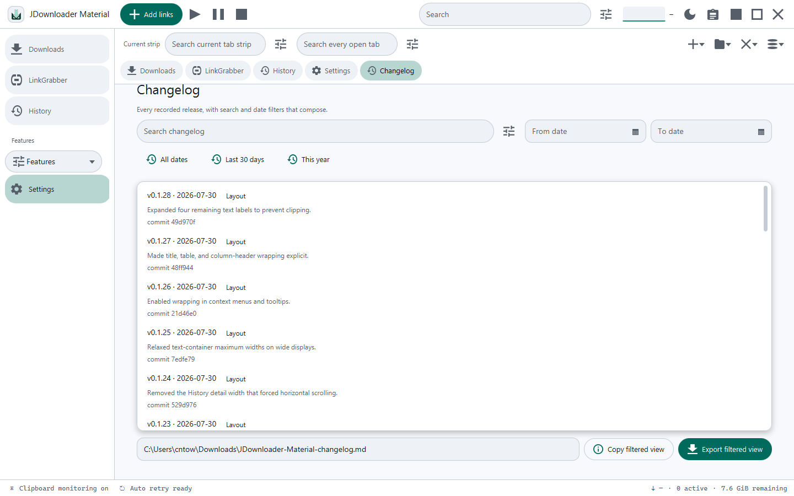
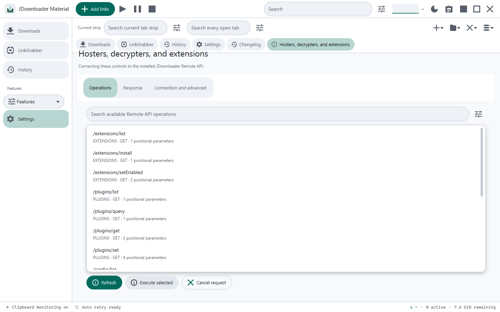
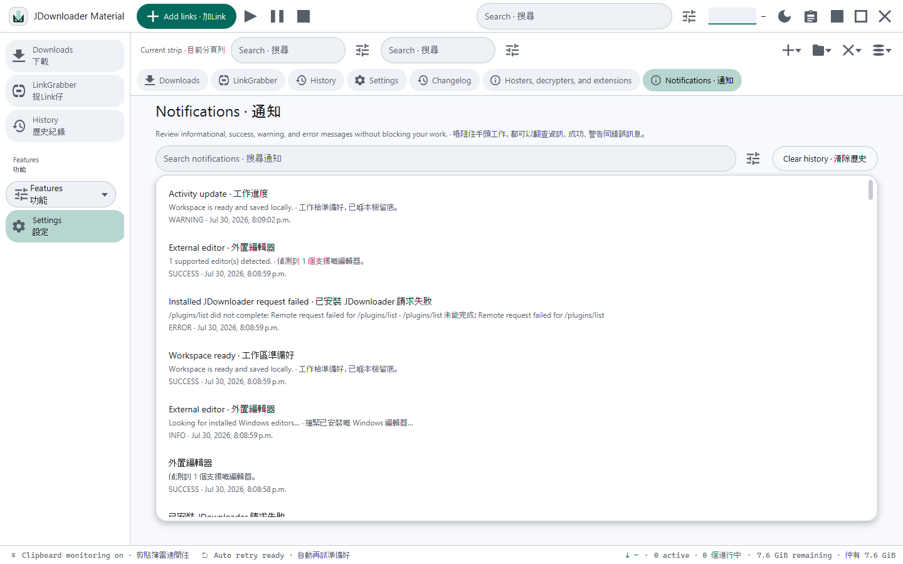
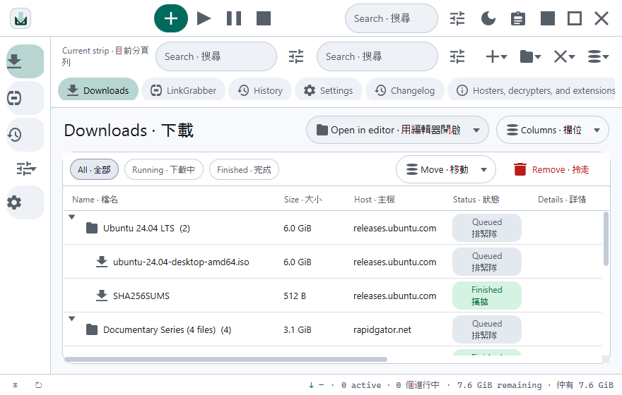
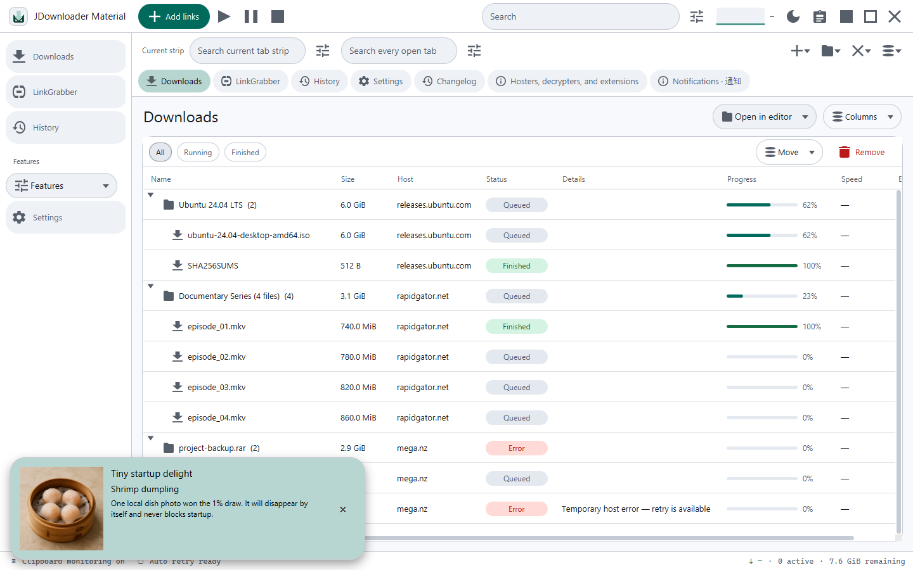

# JDownloader Material

JDownloader Material is a Windows JavaFX desktop app for direct HTTP(S) files and an optional
strict-loopback bridge to an installed JDownloader instance. Its mint-teal Material 3 workspace
combines browser-style tabs, Downloads, LinkGrabber, History, Settings, notifications, changelog and
stock JDownloader feature pages while network, disk, search and append-only history work continue in
the background.

Normal direct downloads use `DirectHttpEngine`; `SimulatedEngine` is limited to deterministic
documentation capture. The project does not embed JDownloader core or use My.JDownloader cloud.
When the user opens a stock feature page, the separate loopback client can invoke the documented API
of JDownloader already running on the same Windows computer.

- **Runtime:** Windows x64, Java 25 (Temurin) and JavaFX 25
- **UI:** JavaFX, MaterialFX, and a hand-authored compact Material 3 system
- **Languages:** English, playful Hong Kong Cantonese, or bilingual English / Hong Kong Cantonese
- **Appearance:** light/dark, density, seed/accent color, fonts and per-element live overrides
- **Download scope:** direct HTTP/HTTPS plus an optional installed-JDownloader loopback bridge
- **Interactive demo:** [GitHub Pages](https://ding-ding-projects.github.io/jdownloader-material/)

## Interface

The desktop shell keeps global work in stable positions:

- a **52 px global toolbar** with Add Links, Start, Pause/Resume, Stop, contextual RE2/J-capable
  search, aggregate throughput, theme, clipboard monitoring, and window controls;
- a **responsive navigation rail** that is 208 px wide normally and collapses to a 72 px icon rail
  below 980 px, where the global search and throughput trace also hide;
- a persistent browser-style workspace with protected pinned tabs, ordered/collapsible groups,
  horizontal overflow, four discovery searches and previewed bulk close;
- dense page panels with 62 px headings, 48 px action rows, 34 px table headers, and 48 px data rows;
- a **30 px status bar** for aggregate speed, running count, remaining bytes, retry state, and the
  latest activity message; and
- a **440 px Add Links drawer** with a scrim, explicit close/cancel actions, initial keyboard focus,
  and Escape dismissal.

Downloads, LinkGrabber, History and Settings remain primary rail destinations, but the rail now
opens or focuses workspace tabs. The New Tab menu adds Notifications, Changelog and installed-
JDownloader pages. Every search field keeps plain text as the default and opens its own adjacent,
anchored full regex builder. [Read the UI guide](docs/UI_GUIDE.md), explore the
[design system](docs/DESIGN_SYSTEM.md), or try the
[interactive GitHub Pages demo](https://ding-ding-projects.github.io/jdownloader-material/).

## Visual tour

All 26 gallery images are captured from the current running JavaFX application.

### Downloads

| Light | Dark |
| --- | --- |
|  |  |

| Status feedback | Selected item, light | Selected item, dark |
| --- | --- | --- |
|  |  |  |

| Hong Kong Cantonese | Bilingual English / Hong Kong Cantonese |
| --- | --- |
|  |  |

### LinkGrabber

| Light | Dark | Hong Kong Cantonese |
| --- | --- | --- |
|  |  |  |

### History

| Light | Dark | Bilingual English / Hong Kong Cantonese |
| --- | --- | --- |
|  |  |  |

### Settings

| General, light | General, dark |
| --- | --- |
|  |  |

| Appearance, light | Appearance, dark | Appearance, bilingual |
| --- | --- | --- |
|  |  |  |

### Add Links drawer

| Light | Dark | Bilingual English / Hong Kong Cantonese |
| --- | --- | --- |
|  |  |  |

### Workspace services

| Changelog | Installed-JDownloader bridge | Notification history |
| --- | --- | --- |
|  |  |  |

### Responsive layout and startup delight

| Bilingual compact width | Non-blocking dim-sum surprise |
| --- | --- |
|  |  |

## Current capabilities

- **Downloads** — package-to-file tree with name, size, host, status, details, progress, speed, and
  ETA. All / Running / Finished filters, Move, Remove, row context actions, and queue-safe inline
  name/destination editing complement the global transfer controls and search.
- **LinkGrabber** — staged direct URLs with asynchronous metadata probes, availability filtering,
  Add Links, Paste, Remove, Add to Downloads, and Add all.
- **Add Links drawer** — submits one or more direct HTTP(S) URLs with an optional package name and
  destination. Add queues them in LinkGrabber; Add & start begins confirmed work without blocking
  navigation.
- **Direct transfers** — redirect-aware probing, background streaming, resumable `.part` files,
  atomic finalization where supported, global/per-host concurrency, speed limiting, nonmodal
  collision policies, and bounded automatic retry for transient failures.
- **History** — a split timeline/preview view over append-only local Git history for Downloads,
  LinkGrabber, and non-secret Settings. Undo, redo, and restore append new events.
- **Workspace tabs** — reorder, pin, group, collapse, search and bulk-close open pages. Structural
  changes persist in a private append-only JGit repository; unsaved pages remain protected.
- **Safe search** — RE2/J-backed plain/regex search with guided construction, flags, bounded sample
  evaluation, live matches/captures and copy/export. Independent builders cover global, Settings,
  properties, notification, changelog, tab and installed-JDownloader searches.
- **Material 3 appearance** — global theme/density/seed/font controls and stable per-element/state
  overrides with anchored editing, presets, reset, import/export, full color translation and deep
  typography controls.
- **Settings** — searchable General, Connection, Recovery, LinkGrabber, Appearance, Backup and About
  tabs. Encrypted backup file work is asynchronous.
- **Localization and voice** — English, playful Hong Kong Cantonese and bilingual copy apply
  immediately. Independent 1–5 English/Cantonese funny sliders and their all-message disclosure
  persist across restarts.
- **Notifications** — bottom-right non-blocking toast stack with severity-aware timeouts plus a
  bounded, searchable local history page.
- **Changelog** — every bundled release entry can be searched, date-filtered, copied and exported as
  Markdown without a network request.
- **Dim-sum surprise** — a first-run-safe, exactly-once 1% startup draw can show one bundled,
  accessible dish card for eight seconds; Settings can disable it.
- **External editor** — Windows editor discovery plus persisted structured launch configuration for
  owned folders/files, with no shell interpolation.
- **Installed JDownloader bridge** — loopback-only, bounded and cancellable access to stock feature
  pages, with one-use confirmation tokens around destructive requests and no stored passwords.
- **Accessible compact UI** — named rail and icon actions, linked Settings labels, readable bilingual
  state chips, and a focus-managed Add Links dialog keep dense workflows usable at compact width.

## Windows installer releases

Every branch push and manual workflow dispatch runs every discovered desktop smoke main under Xvfb, the
static Pages guard and bundled dim-sum image validation before a draft GitHub release can exist. A
qualifying run uses a unique, non-reused tag and builds exactly one self-contained Windows x64 EXE
with its Java 25 runtime and the project icon. GitHub Actions uploads that installer directly to the
draft with no retained workflow artifacts. The final check publishes only after it finds the EXE
plus one locally bundled dim-sum photograph identified in the release notes. A failed build removes
only its incomplete draft; an already-published release is never refreshed.

- [Latest release](https://github.com/Ding-Ding-Projects/jdownloader-material/releases/latest)
- [Windows x64 installer](https://github.com/Ding-Ding-Projects/jdownloader-material/releases/latest/download/JDownloader-Material-windows-x64.exe)

The release tag and About page include the generated build version. The Windows package is currently
unsigned, so SmartScreen can display the platform's normal security notice.

## Building and running

**Zero-setup (recommended)** — no Java or Maven required:

~~~sh
run.cmd
~~~

The Windows script finds a JDK 25+ through `JAVA_HOME`, `PATH`, or a project-local `.jdk/` directory.
When needed, it provisions Eclipse Temurin 25 through the Adoptium API, then builds and launches
through the Maven Wrapper. The first provisioned run needs an internet connection.

With an existing JDK 25+ and Maven 3.9+:

~~~sh
mvn javafx:run       # build and launch
mvn compile          # compile only
mvn package          # build a jar
~~~

## Verification

The maintained [UI smoke handoff](docs/UI_SMOKE.md) records the route, accessibility, compact-layout,
and gallery checks used for this revision. It also lists reproducible manual-smoke and screenshot
commands for future interface changes.

The [categorized documentation index](docs/README.md) describes the implemented desktop behavior.
The factual [roadmap](ROADMAP.md) and current [handoff](HANDOFF.md) keep local implementation evidence
separate from the remote push, Actions, installer, Pages and wiki evidence.

## Local data and privacy

The restart journal and append-only history repositories live below
`~/.jdownloader-material/` and have no configured remote. History retains direct-link URLs so a
restored list remains useful, including signed parameters; treat the directory as private data.
Credential fields, completed file contents, and `.part` contents do not enter history. Settings
backup files are written only to the path selected in Settings.

## Project layout

~~~text
src/main/java/org/jdownloader/material/
  app/       Application entry point (JDMaterialApp, Launcher)
  model/     DownloadItem/Link/Package, CrawledLink/Package, states
  engine/    DownloadEngine, DirectHttpEngine, SimulatedEngine, state and settings
  appearance/ persisted profiles, targets, properties, presets and color translation
  changelog/  bundled factual release records and filtered Markdown export
  dimsum/     exactly-once startup selection policy and bundled dish model
  integration/ external-editor and strict-loopback installed-JDownloader clients
  notification/ bounded active/history notification service
  search/     bounded RE2/J search model
  ui/        MainWindow, ThemeManager, Icons
  ui/view/   downloads, LinkGrabber, history, settings, notifications and changelog
  ui/appearance/ anchored per-element editor, font picker and infinite color translator
  ui/search/ independent SearchField and RegexBuilderPopover
  ui/workspace/ persistent browser-style tab strip
  ui/component/ Mat, DownloadCells, StatusBar, ThroughputMeter, ActivityStatus
src/main/resources/
  icons/app.png                        application mark
  css/theme-light.css / theme-dark.css canonical light/dark color roles
  css/material.css                     compact desktop component system
docs/        categorized feature contracts plus detailed architecture, UI, engine, and history docs
release-assets/dimsum/  release-safe dim-sum photos and bilingual catalog
site/        GitHub Pages overview and interactive demo
~~~

## Project identity

JDownloader Material is independently implemented. The JDownloader name, core and installed-app
Remote API are the work of AppWork GmbH; this project has its own direct-transfer engine, UI and
local data model. The optional bridge talks only to an already-installed local JDownloader process.
Its mint/deep-teal download mark is a project-specific derived asset, not an official JDownloader
trademark asset.

## License

Intended to track upstream JDownloader licensing.
