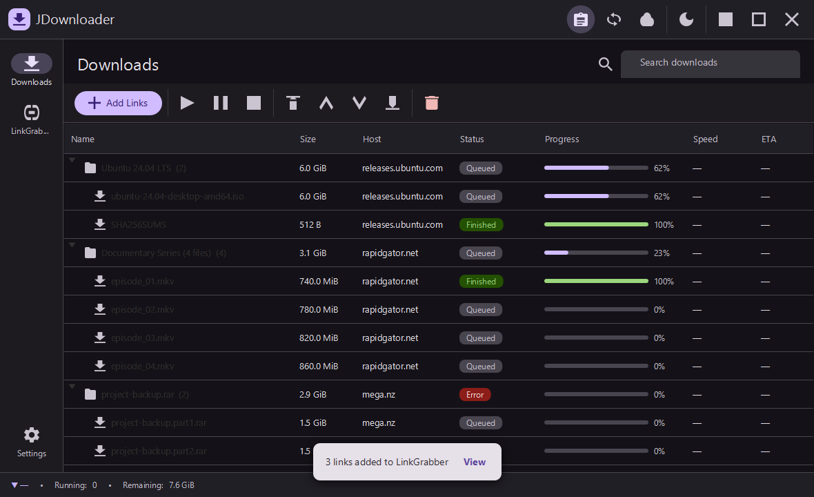
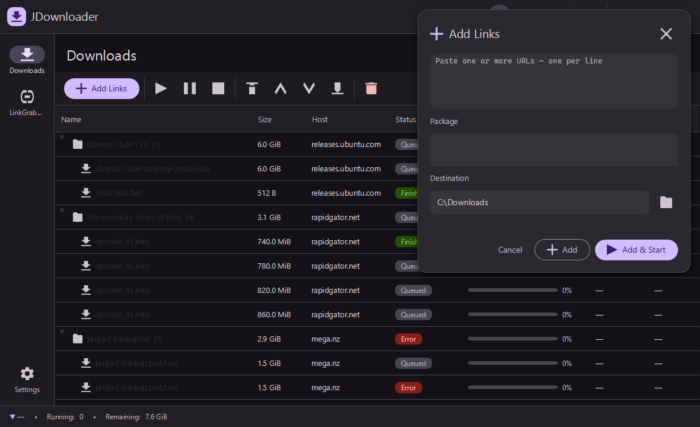

# UI guide

JDownloader Material uses one Material 3 shell around every primary screen. The normal desktop
window does not show a second native title bar: its app bar owns window movement and window
controls so the UI stays visually consistent across the application.

## Shell

- **Top app bar** — identifies the application and holds clipboard monitoring, automatic
  reconnect, reconnect-now, theme, minimize, maximize/restore, and close controls. Drag an
  unused part of the bar to move the window; double-click it to maximize or restore it.
- **Navigation rail** — switches between Downloads, LinkGrabber, and Settings while preserving
  the shared shell and status information.
- **Status bar** — reports global transfer speed, active download count, remaining bytes, and
  reconnect state.
- **Light and dark themes** — are switched from the app bar. Every surface, table, chip, and
  in-app overlay re-resolves from the same theme tokens.

## Downloads

The Downloads screen is a package-to-file tree. It shows name, size, host, status, progress,
speed, and ETA, with package aggregates and state-colored progress. The toolbar contains the
primary transfer and ordering actions; search filters the tree live.

| Light | Dark |
| --- | --- |
|  |  |

## LinkGrabber

LinkGrabber is the staging area for discovered links. It supports availability checks, adding or
pasting links, removing staged entries, and confirming them into Downloads.

| Light | Dark |
| --- | --- |
|  |  |

## Settings

Settings groups General, Connection, Reconnect, LinkGrabber, Appearance, Accounts, Backup, and
About controls behind its own page rail. The default download folder uses the platform-native
path separator on Windows, Linux, and macOS.

| Light | Dark |
| --- | --- |
|  |  |

## In-app feedback

Actions report through non-modal snackbars and notification cards. The Add Links form is a
persistent in-app panel rather than a modal dialog, keeping the underlying queue visible.

| Snackbar | Add Links panel |
| --- | --- |
|  |  |

## Regenerating the gallery

The application has an opt-in documentation capture mode. It renders eight deterministic scene
snapshots and exits when they are written; normal launches are unaffected.

From PowerShell with JDK 25 available:

```powershell
$env:JD_SCREENSHOT_DIR = (Resolve-Path "docs/screenshots").Path
.\mvnw.cmd javafx:run
```

This refreshes the eight screenshots referenced above: Downloads, LinkGrabber, and Settings in
both themes, plus a dark snackbar and Add Links panel.
