# UI guide

JDownloader Material is a compact Material 3 desktop interface for direct HTTP(S) downloads. The
mint-teal rewrite keeps global transfer controls, page navigation, search, and telemetry in stable
positions while network and storage work continues in the background. A runnable approximation of
the shell is also available in the
[interactive GitHub Pages demo](https://codingmachineedge.github.io/jdownloader-material/).

## Application shell

The borderless JavaFX window is divided into four persistent regions.

| Region | Geometry and role |
| --- | --- |
| Global toolbar | Fixed at 52 px. Contains the project mark, Add Links, Start, Pause/Resume, Stop, contextual search, aggregate throughput trace/value, theme, clipboard monitoring, and minimize/maximize/close controls. |
| Primary navigation | 208 px expanded rail for Downloads, LinkGrabber, History, and Settings. It collapses to a 72 px icon rail below 980 px. |
| Page content | A 62 px heading above a bordered, 16 px-radius work panel. Tables and settings use compact desktop spacing rather than card-heavy mobile layouts. |
| Status bar | Fixed at 30 px. Shows global speed, running count, remaining bytes, scheduled retry state, and the latest fixed activity message. |

Drag unused toolbar space to move the window and double-click it to maximize or restore it. The
native-style window buttons remain on the right. At compact width, the brand label, navigation
labels, global search, and throughput trace hide; tooltips retain the navigation names.

### Global controls and search

Start, Pause/Resume, and Stop always target the direct-download scheduler, so transfer control does
not move when the active page changes. Add Links always opens the drawer over the current page.
The theme and clipboard-monitoring buttons also remain global.

Search follows the active destination:

- **Downloads** matches package names and file names/hosts, then combines that text query with the
  All / Running / Finished state filter.
- **LinkGrabber** matches staged package names and link names/hosts, then combines it with the
  availability filter.
- **History** matches operation, summary, scope, status, entry identifier, and related entry.
- **Settings** disables search because its own section rail is the navigation model.

The top throughput component exposes its formatted value as accessible text. The bottom status bar
remains visible on every page and reports long-running work without covering content.

## Dense panels and tables

The content system is designed for continuous queue scanning:

- major panels use a one-pixel semantic border and a 16 px radius;
- table action bars are 48 px high, headers are 34 px, and package/file rows are 48 px;
- numeric diagnostics use a monospace fallback stack;
- state chips, dots, progress tracks, and text labels distinguish queued, running, paused,
  finished, error, disabled, checking, online, and offline states; and
- hover, selection, pressed, and keyboard-focus states come from shared theme roles.

Status is never communicated by color alone: chips and rows retain state text, progress values,
icons, or supporting copy.

## Downloads

Downloads is a package-to-file tree with Name, Size, Host, Status, Details, Progress, Speed, and
ETA. Package rows aggregate their children. The global search filters the model live, while the
local toolbar supplies All / Running / Finished filters plus Move and Remove.

The row menu provides Start, Force Start, Stop, enable/disable, priority, completed-file actions,
expand/collapse, and removal. File-manager actions run outside the JavaFX thread. Selecting one
queued, error, or disabled item reveals an inline properties strip below the table for its name and
next destination. A package is editable only when all children are in those safe states; its
destination change applies to every child.

For direct HTTP(S) files, background workers stream bytes while the scheduler honors global
simultaneous-download and per-host limits. Pause holds active transfers without removing them.
Stop returns work to Queue and leaves partial data available for a later start.

| Light | Dark |
| --- | --- |
|  |  |

| Fixed status feedback | Selected item, light | Selected item, dark |
| --- | --- | --- |
| 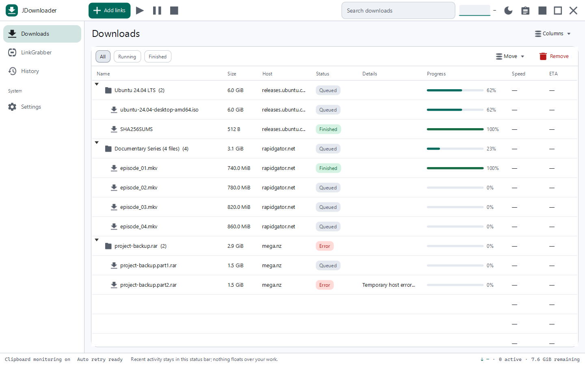 | 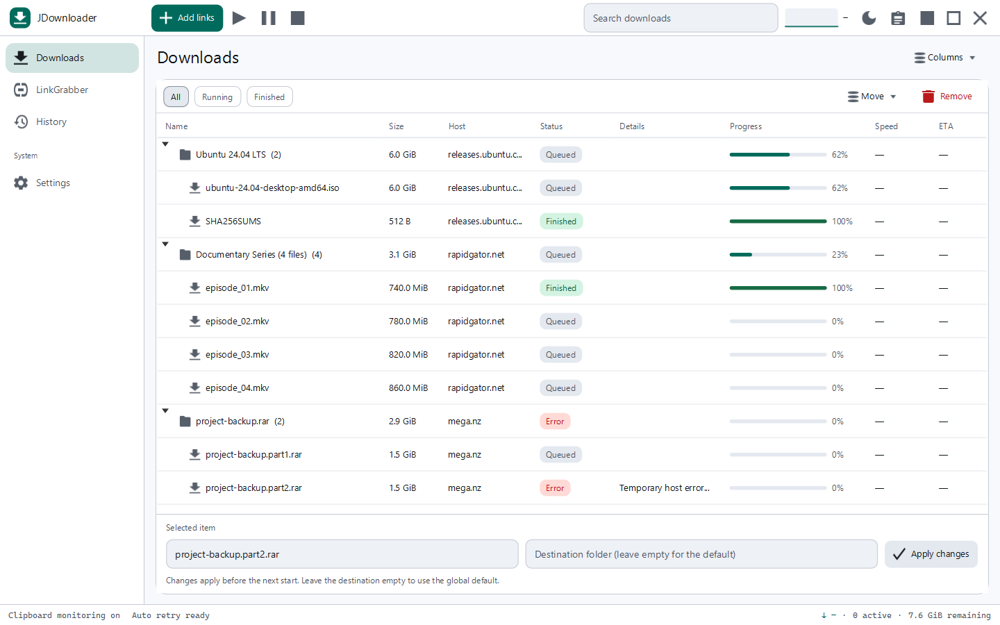 | 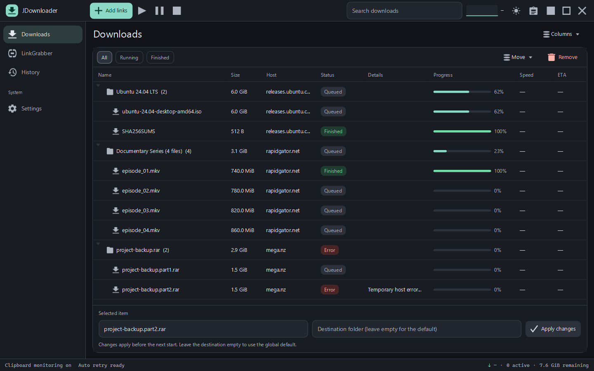 |

## LinkGrabber

LinkGrabber stages direct URLs in a package-to-link tree. `DirectHttpEngine` probes metadata in the
background with HEAD first and a ranged GET fallback, follows redirects, and updates availability,
filename, and known size when supplied by the server.

The local toolbar cycles All / Checking / Online / Offline availability, opens Add Links, pastes
from the clipboard, confirms the selected rows, confirms all online rows, or removes the selection.
Auto-confirm moves verified rows forward after probing; auto-start starts those results. Navigation
and global transfer controls remain usable while checks continue.

| Light | Dark | Hong Kong Cantonese |
| --- | --- | --- |
|  |  | 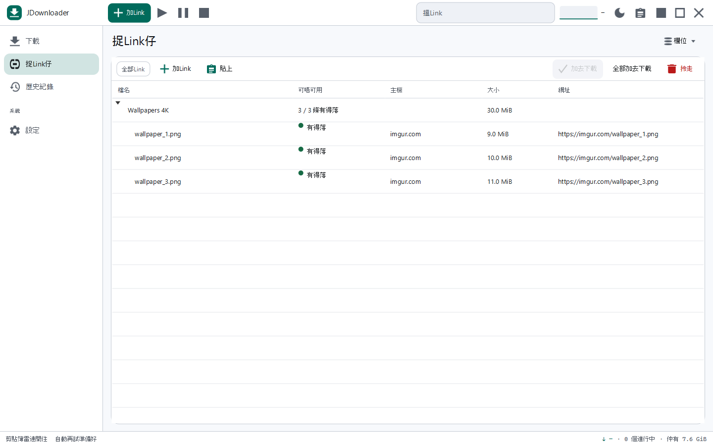 |

## History

History is a local, asynchronous browser for append-only Downloads, LinkGrabber, and non-secret
Settings snapshots. The page uses a split view: the left timeline occupies roughly 44 percent and
the right side previews the selected event. A scope selector narrows the timeline to all changes,
Downloads, LinkGrabber, or Settings; global search narrows it further.

The heading displays local storage size and the available Undo/Redo actions. The preview shows the
event operation, scope, time, status, related revision, and any storage error. Restore applies the
chosen snapshot and appends another event rather than rewriting earlier history.

History stores model snapshots only. Credentials, completed file contents, `.part` contents,
byte-progress/speed telemetry, retry timing, and live worker details stay outside its repositories.
Direct-link URLs remain intact for faithful restore, including signed parameters, so treat the
history directory as private data. Restoring stops active transfers safely, changes only the app
model, and leaves files on disk alone. See [History Manager](HISTORY.md).

| Light | Dark | Bilingual English / Hong Kong Cantonese |
| --- | --- | --- |
| 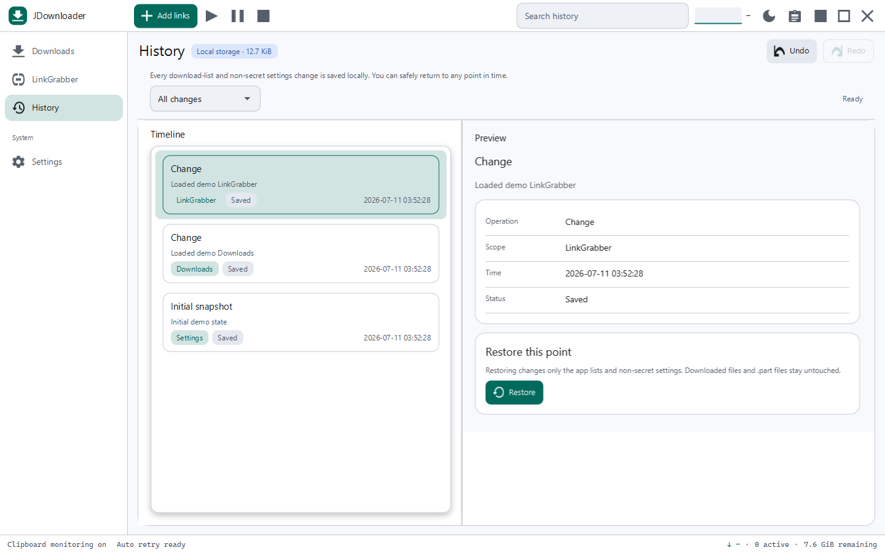 | 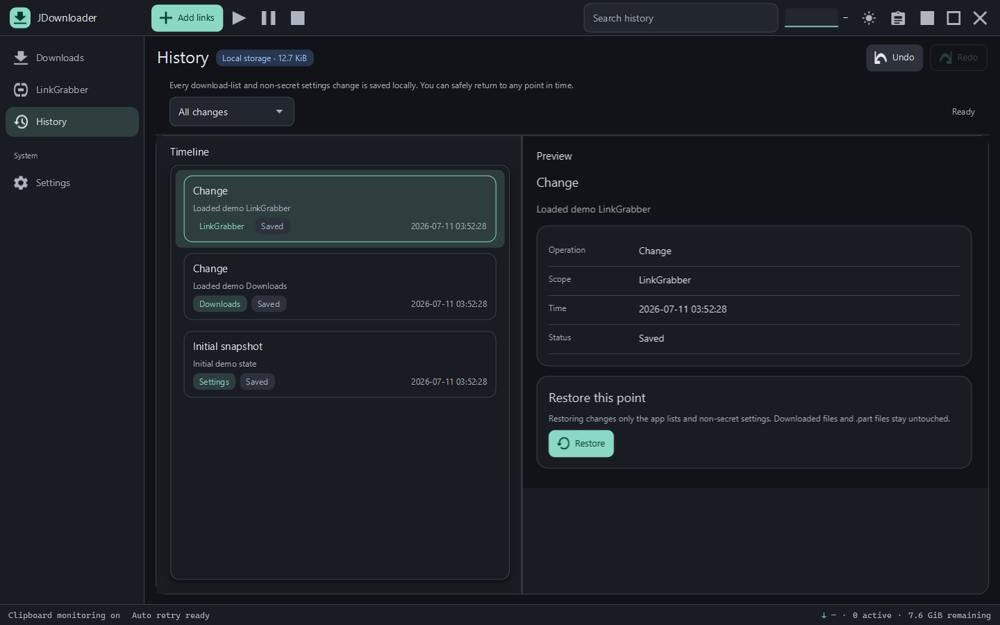 | 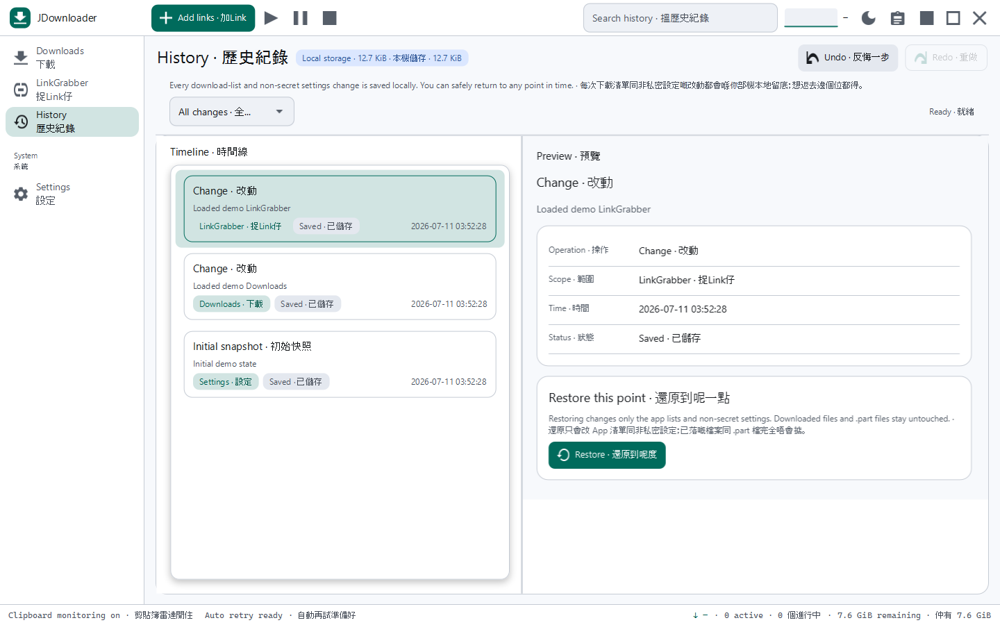 |

## Settings

Settings is a two-pane view inside the standard work panel. A fixed 220 px section list on the left
selects a scroll-managed detail page on the right. General, Connection, Recovery, LinkGrabber,
Appearance, Backup, and About use concise 62 px rows: a title and supporting sentence on the left,
with one direct control on the right.

- **General** controls the default folder, simultaneous downloads, and file-collision behavior.
- **Connection** controls the global speed cap and per-host connection limit.
- **Recovery** controls bounded retry for transient network, 408, 429, and 5xx failures.
- **LinkGrabber** controls clipboard monitoring, auto-confirm, auto-start, and add-at-top.
- **Appearance** controls light/dark theme, title-bar speed, and language.
- **Backup** exports or imports encrypted settings on background workers.
- **About** identifies the build and the project's direct-download scope.

Every displayed setting controls live direct-download behavior or a persisted presentation
preference. The default collision choice safely auto-renames without opening a prompt; Skip,
Overwrite, and Auto-rename alternatives also remain nonmodal.

| General, light | General, dark |
| --- | --- |
|  |  |

| Appearance, light | Appearance, dark | Appearance, bilingual |
| --- | --- | --- |
| 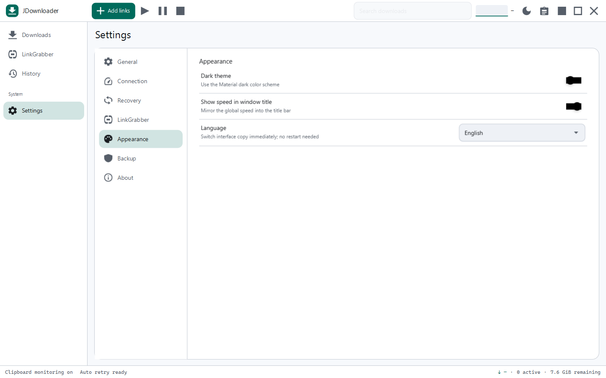 | 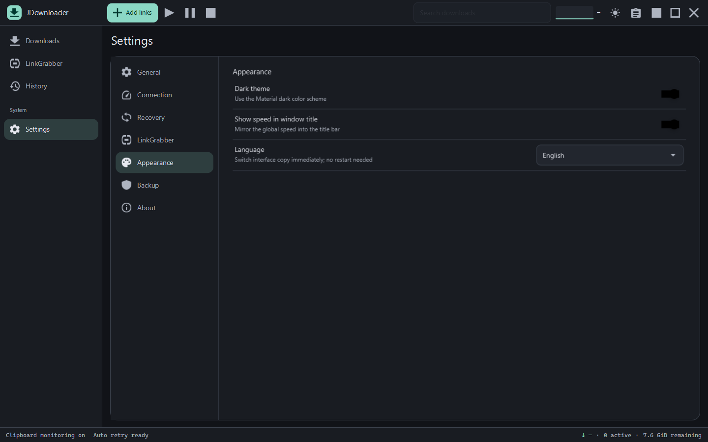 | 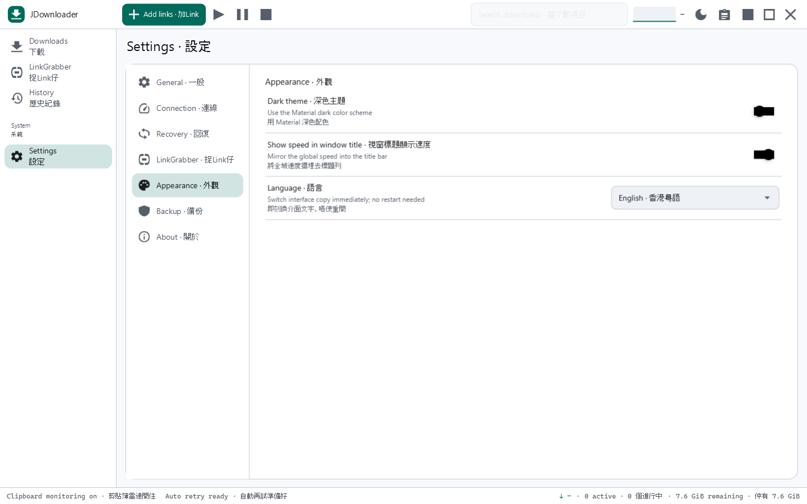 |

## Add Links drawer

Add Links is a task drawer rather than a page or modal dialog. It slides in from the right at up to
440 px over a scrim and leaves the current destination visible beneath it. Focus moves to the URLs
field after the 260 ms transition. Close, Cancel, clicking the scrim, or pressing Escape dismisses
it.

Paste one or more direct HTTP(S) URLs, optionally set a package name and destination, then choose:

1. **Add** to accept the URLs, continue background checks, close the drawer, and
   show LinkGrabber.
2. **Add & start** to accept the URLs, continue probe/confirmation/start work, and close the
   drawer without blocking the page.

Inline copy reports validation and acceptance. Invalid input remains available for editing. An
accepted submission clears only the exact draft that was sent, so a newer edit made while the
background operation was running is preserved.

| Light | Dark | Bilingual English / Hong Kong Cantonese |
| --- | --- | --- |
|  |  | 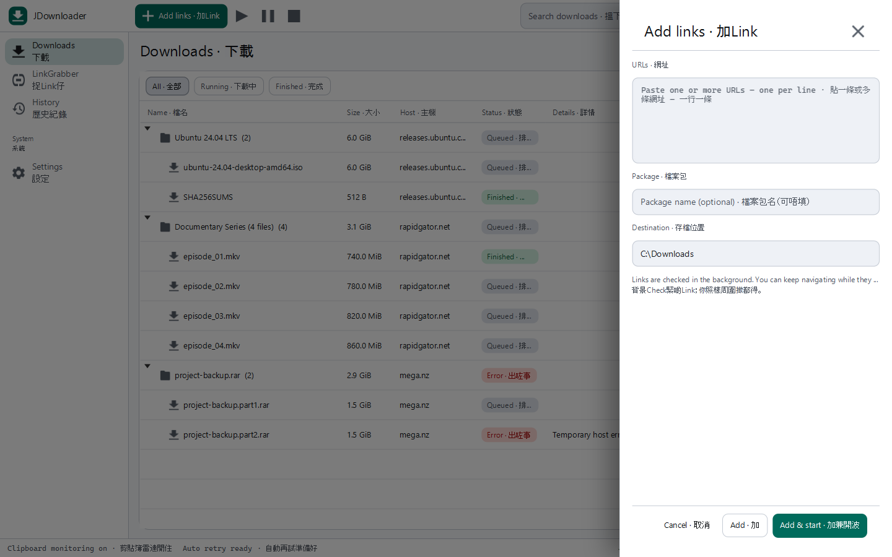 |

## Language

**Settings → Appearance → Language** switches the interface immediately and saves the selection in
local settings and encrypted backup. Choose English, playful Hong Kong Cantonese, or bilingual
English / Hong Kong Cantonese. Bilingual mode combines compact labels with a separator and stacks
longer supporting copy where needed. The selected Settings section and any open Add Links draft are
retained while translated controls rebuild; the transfer engine keeps running.

| Hong Kong Cantonese | Bilingual English / Hong Kong Cantonese |
| --- | --- |
| 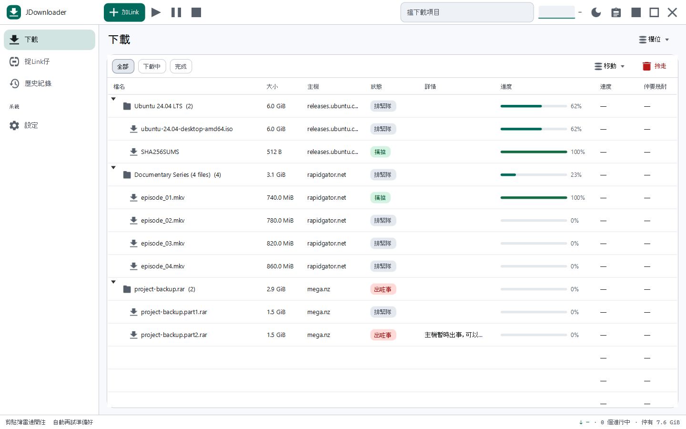 | 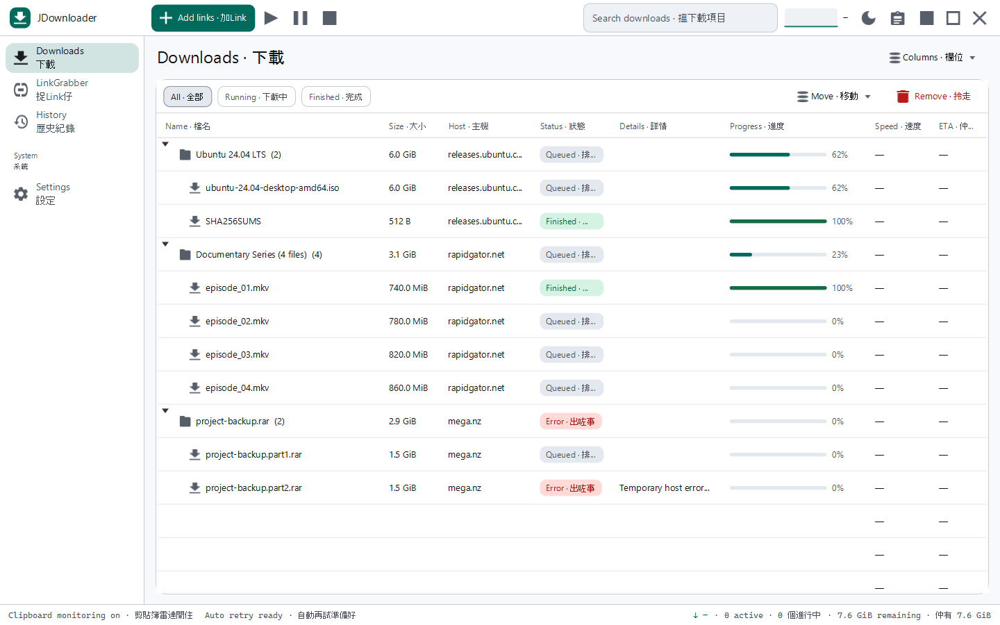 |

## Accessibility and keyboard behavior

The interface uses standard JavaFX buttons, toggles, fields, lists, and tables so normal keyboard
traversal and activation remain available. The visual system adds:

- a two-pixel primary focus outline on navigation, buttons, fields, and settings destinations, plus
  a primary focused boundary on table rows;
- visible text labels for primary actions and tooltips for compact icon controls;
- text or icon reinforcement for every semantic status color;
- an accessible text role/value for the throughput display;
- automatic focus transfer to the first Add Links field and Escape dismissal; and
- fixed inline status and activity copy instead of time-limited overlays.

The current implementation does not claim complete shortcut coverage or screen-reader
announcements for every dynamic queue mutation.

## Transfers, partial files, and recovery

A real transfer writes to a final-name `.part` file. Starting it again requests the remaining
range; a server that accepts ranges reuses existing bytes, while an incompatible response restarts
the partial stream safely. Successful downloads move to their final name atomically where the
filesystem supports it.

When transient retry is enabled, network errors and HTTP 408, 429, and 5xx responses use bounded
2/4/8/16-second backoff. Details show the countdown; permanent errors remain in the table for a
later Start or Force Start.

`DirectHttpEngine` keeps supported settings, Downloads packages/links, and LinkGrabber
packages/links in a restart journal below `~/.jdownloader-material/`. A running or paused transfer
returns as queued after restart because its HTTP stream ended with the process. Starting it again
can reuse retained `.part` bytes. The separate append-only History Manager provides durable model
undo/restore without versioning downloaded file contents.

## Regenerating the gallery

Documentation capture opts into `SimulatedEngine`, seeds deterministic rows, renders the 21 scenes
used above, and exits. Ordinary launches continue to use `DirectHttpEngine`.

From PowerShell with JDK 25 available:

~~~powershell
$env:JD_SCREENSHOT_DIR = (Resolve-Path "docs/screenshots").Path
.\mvnw.cmd javafx:run
~~~

The command refreshes Downloads light/dark/status/properties/Cantonese/bilingual; LinkGrabber
light/dark/Cantonese; History light/dark/bilingual; Settings general light/dark and Appearance
light/dark/bilingual; and Add Links light/dark/bilingual.
