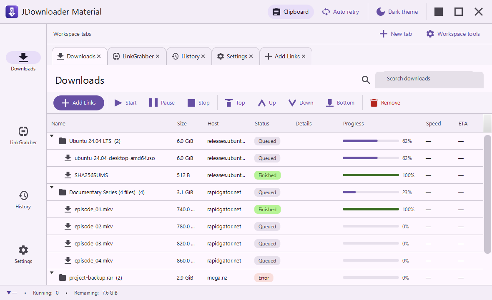
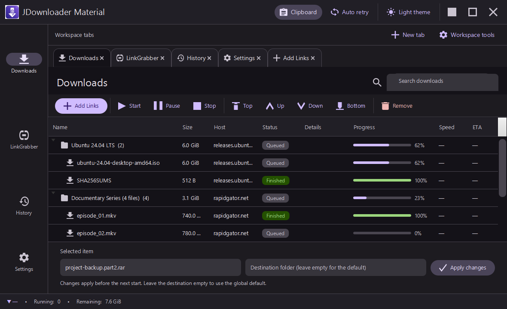
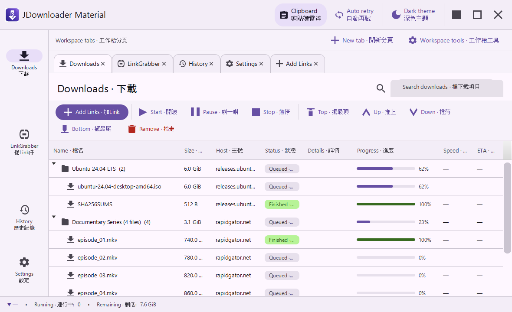

# UI guide

JDownloader Material is a Material 3 workspace for direct HTTP(S) downloads. Its custom app bar
owns window movement and window controls, so the window stays visually consistent from the top bar
through the fixed status line.

## Shell and workspace tabs

- **Top app bar** — shows the saved application name and hosts clipboard monitoring, transient
  retry behavior, theme, and native-style window actions. Application actions pair an icon with a
  text label; drag unused app-bar space to move the window and double-click it to maximize or
  restore it.
- **Workspace tab strip** — works like a browser: each open tab contains one page instance.
  Open Downloads, LinkGrabber, History, Settings, or Add Links in separate tabs when you want
  independent places to work.
- **Tab editor** — right-click any tab to edit its title, tab-label font family, size, bold,
  italic, and color. The color picker accepts any color. The same workspace controls rename the
  application, open a tab, close a tab, import/export a portable workspace snapshot, and export
  the complete local workspace Git repository.
- **Navigation rail** — opens or focuses Downloads, LinkGrabber, History, and Settings while
  preserving the workspace and status line. Transfer screens also offer Add Links.
- **Status line** — reports aggregate speed, running count, remaining bytes, pending retry, and
  the most recent activity message. Clipboard, validation, and removal feedback stays here in the
  layout instead of covering the active page.
- **Light and dark themes** — switch from the app bar. Every surface, table, chip, inline editor,
  and tab resolves through the same theme tokens.

The workspace state is stored in a private local Git repository at
`~/.jdownloader-material/workspace/`. It records the app name, open and closed tabs, selection,
and each tab's label styling. Each change adds an append-only commit. A portable `.jdmtabs` export
captures the current workspace; repository ZIP export preserves its complete local timeline.

| Workspace tabs light | Workspace tabs dark | Bilingual workspace tabs |
| --- | --- | --- |
|  |  |  |

## Language

**Settings → Appearance → Language** changes the interface immediately and saves the selection in
local settings and encrypted backup. Choose **English**, **Hong Kong Cantonese**, or bilingual
**English / Hong Kong Cantonese**. Bilingual mode presents both versions of standard UI copy;
compact labels use a separator and longer descriptions stack the languages for readability. The
download pipeline, probes, retries, and inline forms continue while the language changes.

| Hong Kong Cantonese | Bilingual English / Hong Kong Cantonese |
| --- | --- |
|  |  |

| Hong Kong Cantonese LinkGrabber | Bilingual Add Links |
| --- | --- |
|  |  |

| English language setting | Bilingual language setting |
| --- | --- |
|  |  |

## History

**History** is a local, asynchronous browser for append-only Downloads, LinkGrabber, and
non-secret Settings snapshots. Search and the scope selector narrow entries by Downloads,
LinkGrabber, Settings, or all activity. Selecting an entry reveals its operation, scope, time,
status, related revision, and any storage message; the header shows local history size.

**Undo**, **Redo**, and **Restore** apply the chosen snapshot and append a new event rather than
rewriting an earlier one. An undo can therefore be undone, and a restored point remains visible
alongside newer events. The page presents ready and busy states inline, without a confirmation
dialog.

History stores list/settings snapshots only. Credential fields, completed file contents, `.part`
file contents, active byte-progress/speed telemetry, retry timing, and live transfer details stay
outside the history repositories. Direct-link URLs remain intact for a faithful restore, including
signed parameters, so treat the local history directory as private device data. Restoring stops
active transfers safely and changes only the application model; it leaves files on disk alone. See
[History Manager](HISTORY.md) for storage and archive guidance.

| History light | History dark | Bilingual History |
| --- | --- | --- |
|  |  |  |

## Downloads

Downloads is a package-to-file tree with Name, Size, Host, Status, Progress, Speed, ETA, and
inline Details for a direct-transfer error or collision result. Package rows aggregate their
children. The labeled toolbar holds transfer and ordering actions, while search filters the tree
live. State changes appear directly in the table and status line.

For direct HTTP(S) files, the engine streams bytes on background workers. The scheduler honors the
global simultaneous-download setting and per-host connection setting. Pause holds active transfers
without dequeuing them; Stop returns them to Queue and preserves partial data for a later start.

The row menu changes transfer state, sets durable priority, and opens completed files or their
folders. File-manager actions run outside the JavaFX thread. Selecting one queued, error, or
disabled link reveals an inline properties strip below the table where its name and next
destination can be changed. A package becomes editable when all of its children are in those safe
states, and its edit applies to every child.

| Selected item light | Selected item dark |
| --- | --- |
|  |  |

| Light | Dark |
| --- | --- |
|  |  |

| Fixed status feedback |
| --- |
|  |

## LinkGrabber

LinkGrabber stages direct URLs. After URLs are queued, `DirectHttpEngine` checks metadata in the
background: it uses HEAD first and a ranged GET fallback, follows redirects, and updates
availability, filename, and known size when supplied by the server. Add Links, Paste, Remove, Add
to Downloads, and the compact All / Checking / Online / Offline availability control work directly
in the page.

Auto-confirm moves verified staged URLs forward after probing. Auto-start starts those results
without extra user interaction. The direct HTTP(S) pipeline keeps the rest of the workspace usable
while metadata work proceeds.

| Light | Dark |
| --- | --- |
|  |  |

## Add Links

**Add Links** is a normal workspace page rather than a floating panel. Paste one or more direct
HTTP(S) URLs, optionally set a package name and destination, then choose one of two paths:

1. **Queue in LinkGrabber** adds the URLs and returns immediately; availability checking runs
   while you navigate elsewhere.
2. **Queue & Start** submits the URLs, waits for background availability checks, then confirms
   verified results and starts them automatically.

The inline status reports acceptance while the engine works. If validation finds no direct URL,
the entered text remains in the composer for editing; an accepted submission clears only the
unchanged input snapshot, so a newer edit is retained.

| Light | Dark |
| --- | --- |
|  |  |

## Transfers, partial files, and collisions

A real transfer writes to a final-name `.part` file. Starting it again requests the remaining
range; a server that accepts ranges reuses existing bytes, while another response restarts the
partial stream safely. Successful downloads move into their final name atomically where the
filesystem supports it.

There is no file-collision dialog in the download path. The default **Ask** setting chooses a safe
auto-name. **Rename**, **Skip**, and **Overwrite** are applied by the background worker, allowing a
batch to continue without user intervention.

When **Retry transient HTTP failures** is enabled, direct transfers retry network, 408, 429, and
5xx failures with bounded exponential backoff. Details show the retry countdown; a permanent
transfer error remains an inline row ready for Start or Force Start.

## Recovery after restart

`DirectHttpEngine` saves supported settings, Downloads packages/links, and LinkGrabber
packages/links in a local journal under `~/.jdownloader-material/`. A running or paused transfer
returns as queued after restart because its live HTTP stream ended with the process. Starting it
again can reuse its `.part` data.

The History Manager keeps separate append-only local Git repositories for reversible model
changes. The workspace repository independently preserves the app name and tabs. Both complement
the restart journal: the journal restores the most recent run state, while local Git keeps durable
timeline records without versioning downloaded file contents.

## Feedback and settings work

Normal actions remain in the page flow. Table state, inline composer results, History timeline,
and the fixed status line provide feedback while navigation and transfers continue. Removals are
reversed through History rather than a transient overlay.

The Backup page keeps export/import inputs inline. Encryption and local file work run
asynchronously, and completion or failure stays in the page. History capture, Git storage,
workspace storage, and restores use the same background-work pattern.

## Settings

Settings groups General, Connection, Network recovery, LinkGrabber, Appearance, Backup, and About
behind its own page rail. The default download folder is an editable path field using the
platform-native separator. Each displayed control drives a live direct-download behavior or a
persisted presentation preference.

| Light | Dark |
| --- | --- |
|  |  |

## Regenerating the gallery

The application has an opt-in documentation capture mode. It selects `SimulatedEngine`, seeds
deterministic sample rows, renders the documented scenes, and exits after writing them. Ordinary
launches continue to select `DirectHttpEngine`.

From PowerShell with JDK 25 available:

~~~powershell
$env:JD_SCREENSHOT_DIR = (Resolve-Path "docs/screenshots").Path
.\mvnw.cmd javafx:run
~~~

The command refreshes the documented Downloads, LinkGrabber, History, Settings, Add Links,
workspace-tab, and language/theme views.
