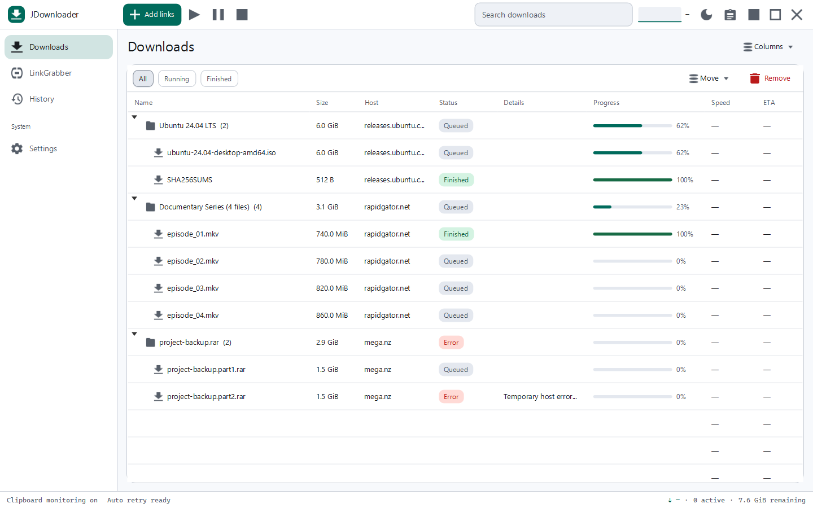
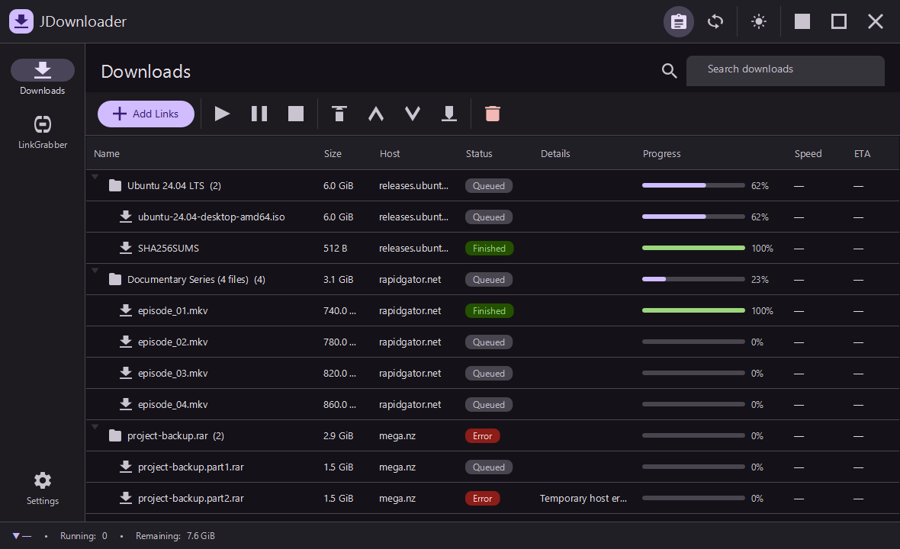
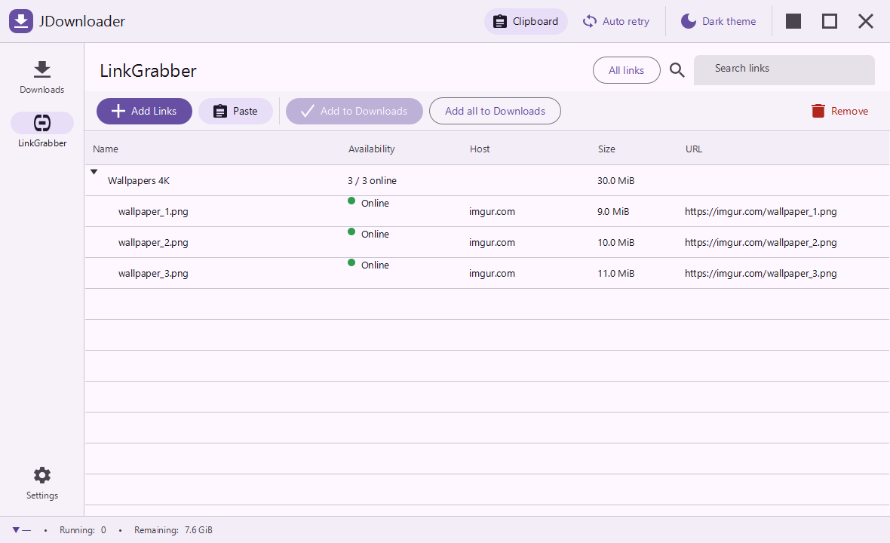
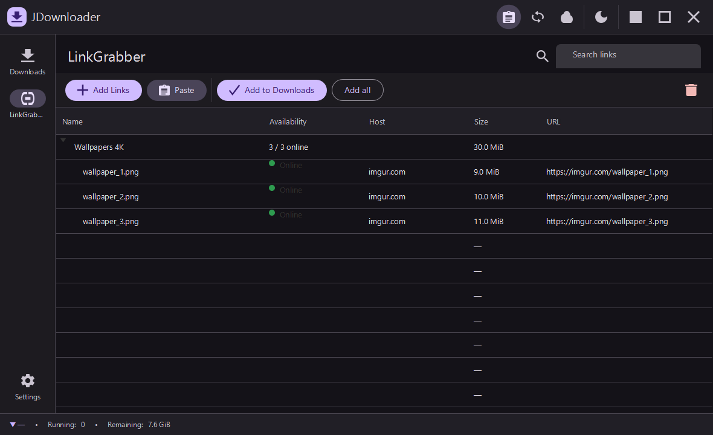
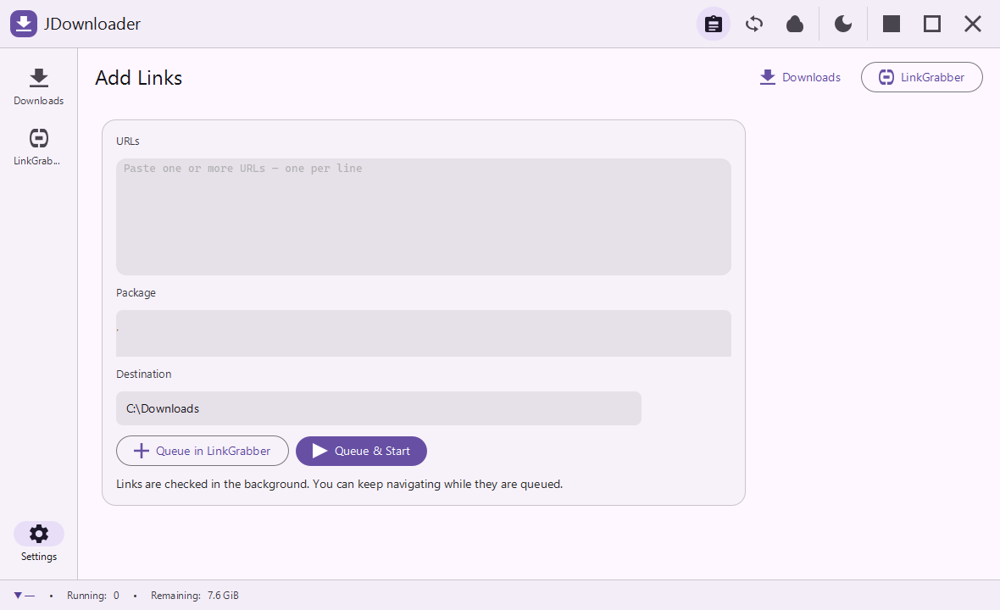
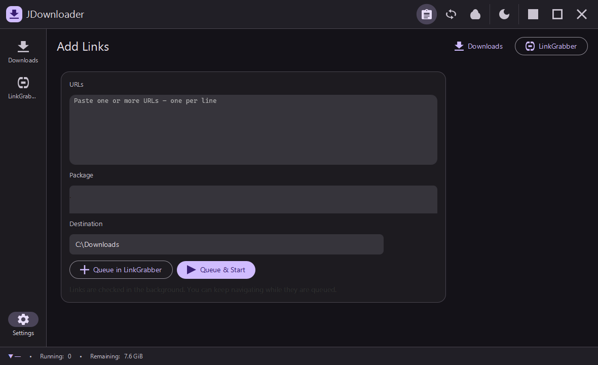
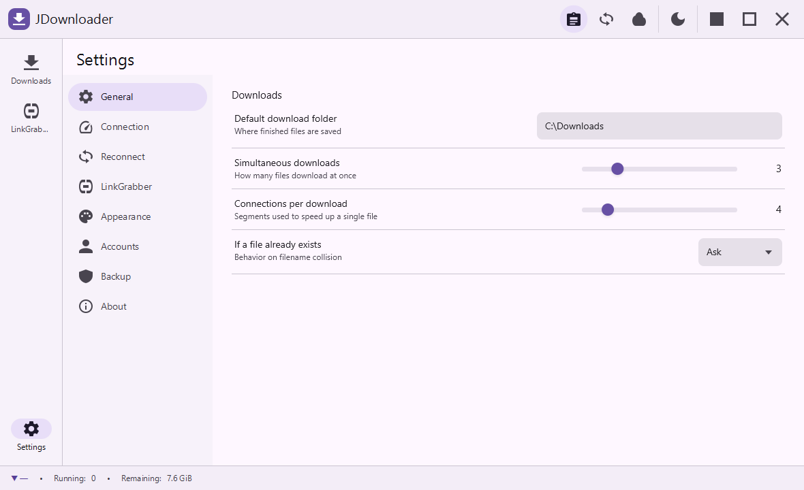
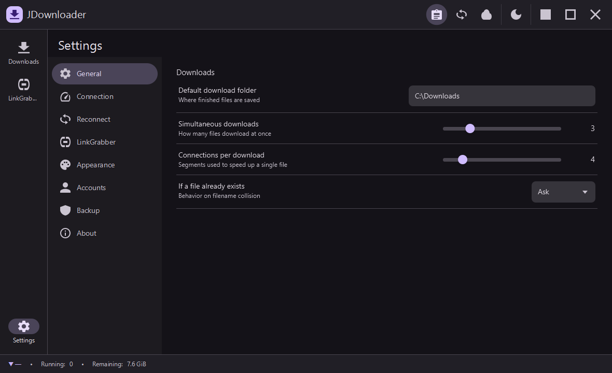

# UI guide

JDownloader Material uses one Material 3 shell around every primary screen. The desktop window
does not show a second native title bar: its app bar owns window movement and window controls,
keeping the application visually consistent.

## Shell

- **Top app bar** - identifies the application and holds clipboard monitoring, automatic
  reconnect, reconnect-now, theme, minimize, maximize/restore, and close controls. Drag an
  unused portion of the bar to move the window; double-click it to maximize or restore it.
- **Navigation rail** - switches between Downloads, LinkGrabber, Settings, and the inline Add
  Links composer while preserving the shell and status bar.
- **Status bar** - reports global transfer speed, active download count, remaining bytes, and
  reconnect state.
- **Light and dark themes** - switch from the app bar. Every surface, table, chip, and inline
  form resolves from the same theme tokens.

## Downloads

Downloads is a package-to-file tree with Name, Size, Host, Status, Progress, Speed, and ETA.
Package rows aggregate their children. The toolbar holds the transfer and ordering actions, and
search filters the tree live. Start, pause, stop, and state changes appear directly in the table
and status bar rather than requiring acknowledgement.

| Light | Dark |
| --- | --- |
|  |  |

## LinkGrabber

LinkGrabber stages discovered links and updates availability after they are queued. It supports
adding or pasting links, removing staged entries, and confirming them to Downloads. The
Auto-confirm and Auto-start settings let a staged URL continue through confirmation and download
start without additional user interaction.

| Light | Dark |
| --- | --- |
|  |  |

## Add Links: queue to download without a blocking prompt

**Add Links** is a normal content view, not a floating panel or modal dialog. Paste one or more
URLs, optionally set a package name and destination, then choose one of two paths:

1. **Queue in LinkGrabber** adds the URLs and returns immediately. Availability checking happens
   after submission while the user can navigate elsewhere.
2. **Queue & Start** queues the URLs, waits for the deferred availability check, then confirms
   them and starts downloading automatically.

The inline status text describes what is happening. Clipboard monitoring follows the same
nonblocking path, and the LinkGrabber Auto-confirm and Auto-start settings can continue it
without a confirmation prompt.

| Light | Dark |
| --- | --- |
|  |  |

## Feedback and settings work

Normal actions do not open cards, panels, or acknowledgement dialogs. Visible state in the
table, composer, and status bar is the primary feedback. A compact transient message may appear
for a reversible or navigable result such as **Undo** or **View**; it does not block input.

The Backup page keeps export/import inputs inline. Encryption and disk work run asynchronously,
and completion or failure is shown in the page, so backup activity does not interrupt the
download workflow.

## Settings

Settings groups General, Connection, Reconnect, LinkGrabber, Appearance, optional
My.JDownloader remote-control credentials, Backup, and About behind its own page rail. The
default download folder is an editable path field using the platform-native separator. No account
is required to use the download workflow.

| Light | Dark |
| --- | --- |
|  |  |

## Regenerating the gallery

The application has an opt-in documentation capture mode. It renders eight deterministic scene
snapshots and exits when they are written; ordinary launches are unaffected.

From PowerShell with JDK 25 available:

~~~powershell
$env:JD_SCREENSHOT_DIR = (Resolve-Path "docs/screenshots").Path
.\mvnw.cmd javafx:run
~~~

This refreshes Downloads, LinkGrabber, Settings, and Add Links in both light and dark themes.
